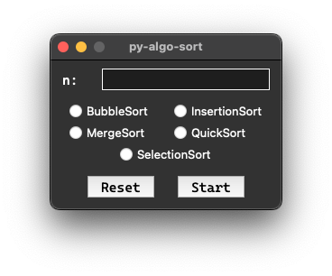
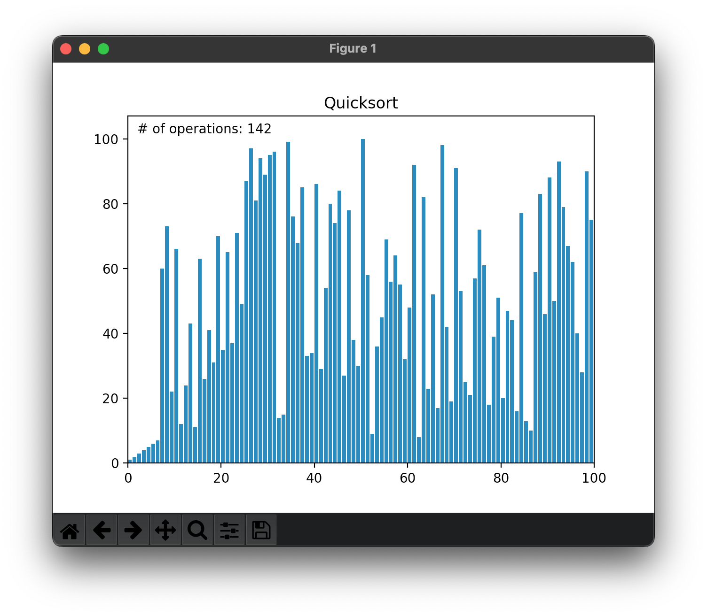

# py-algo-sort

This is a simple project that I had originally integrated into my [algoritmi](https://github.com/AntonioBerna/algoritmi) repository and decided to separate as it represents an interesting animation of the sorting algorithms!

To use my software you will simply have to use the ```make``` command and at the end of the process you will find inside the ```dist``` folder the executable file ```py-algo-sort.app``` which you just need to run to get the following GUI:

<p align="center">
	
</p>

Now you will simply fill in the required fields so that you get a second window similar to this one:

<p align="center">
	  
</p>

# Todo

- [ ] I want to integrate everything into one gui made with Qt

